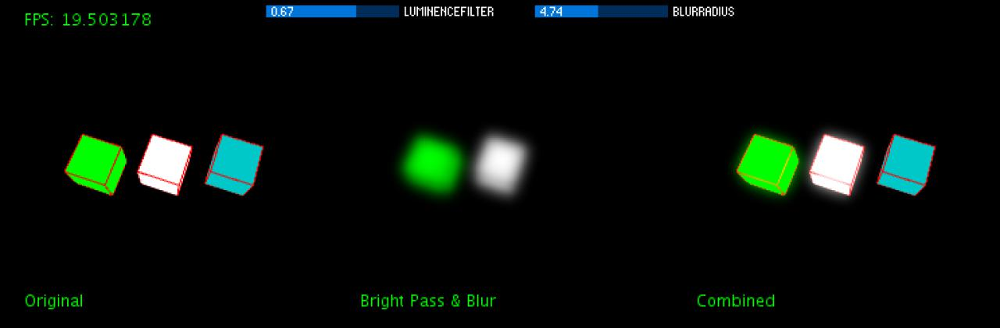

# Processing Bloom Filter
An example of a bloom filter as post FX in [processing3](https://processing.org/).

Post-processing filters are great tools to give a rendered (and realistic) scene more utterance. For example the bloom filter helps to simulate the light diffusion to be more **realistic**.

There are a lot of tutorials which help you to implement a bloom filter in OpenGL (e.g. [Learn OpenGL - Bloom](https://learnopengl.com/#!Advanced-Lighting/Bloom)). But for **processing** I could not find one that is as performant as I needed it in my `P3D` renderings. There are some which are implemented directly on the **CPU** and rely on `loadPixel` to copy the buffer onto the CPU and back to the GPU.

So I tried to find a way between implementing it directly in OpenGL ([with processing](https://github.com/processing/processing/wiki/Advanced-OpenGL)) and the CPU approach. Because the direct implementation in OpenGL could break the processing version independence of my sketches.

Keep in mind that this is **not the fastest** impelmentation, but one that is working with `P3D` and I still try to improve it.

## Implementation

### Basic Idea
To implement a bloom you should first understand how the effect is created:


1. Draw you `original` image
2. Create a `bright pass` image of the `original`
3. Blur the `bright pass` image
4. Screen-blend it over the `original` image

Sound's easy, right?

### Processing
Now how to implement that in processing?

In the idea chapter I was talking about `images` but in `P3D` there is no performant `PImage` implementation. So the idea is to use `PTexture` for the images and render them onto the main context after the process.

To make it as performant as possible you should use [GLSL Shaders](https://processing.org/tutorials/pshader/). For the bloom filter you need one GLSL Shader for the **brightpass** and one for the **blur filter**. We take a look at them later in the shader chapter.

To store the results of our shaders I used `PGraphics` objects. The `canvas` is the original image and the `brightPass` stores the bright pass result.

```java
PGraphics canvas = createGraphics(surfaceWidth, surfaceHeight, P3D);
PGraphics brightPass = createGraphics(surfaceWidth, surfaceHeight, P2D);
```

In every draw call you have first to render your content onto the `canvas`, then copy it onto the `brightpass` graphics and let the shader do the filter work. After the copy process you can **blur** the image with the filter function of processing.

(**!!!** *This is very slow because it runs on the CPU. I am working on a shader based solution!* *!!!*)

```java
// render content onto canvas
canvas.beginDraw();
render(canvas);
canvas.endDraw();

// copy canvas onto bright pass
brightPass.beginDraw();
brightPass.background(0, 0);
brightPass.image(canvas, 0, 0);

// blur the image
brightPass.filter(BLUR, blurRadius);
brightPass.endDraw();
```

Now you just have to draw the original `canvas` first and then the `brightPass` texture graphics onto it. You have to change the `blendMode` to `SCREEN`. Otherwise the image will be black except for your blurred bright spots.

```java
blendMode(BLEND);
image(canvas, 0, 0);

blendMode(SCREEN);
image(brightPass, 0, 0);
```

In my example sketch you see the process visualised in three steps:



#### Shader
To make the filtering faster you have to use GLSL Shaders. Because you are working with `PTexture` it is important to use **texture shaders** and not normal color shaders.

The **vertex shader** is just a basic texture shader which passes the color and position to the renderer.

```glsl
#define PROCESSING_TEXTURE_SHADER

uniform mat4 transform;
uniform mat4 texMatrix;

attribute vec4 vertex;
attribute vec4 color;
attribute vec2 texCoord;

varying vec4 vertColor;
varying vec4 vertTexCoord;

void main() {
  gl_Position = transform * vertex;
    
  vertColor = color;
  vertTexCoord = texMatrix * vec4(texCoord, 1.0, 1.0);
}
```

*Bloom Vertex Shader*

The fragment shader is for the brightpass filter. It filters every color out which has a luminence less then the `brightPassThreshold`. The `luminanceVector` contains the values to get the [relative luminance](https://en.wikipedia.org/wiki/Relative_luminance) of a rgb color value.

```glsl
uniform sampler2D texture;

varying vec4 vertColor;
varying vec4 vertTexCoord;

uniform float brightPassThreshold;

void main() {
	vec3 luminanceVector = vec3(0.2125, 0.7154, 0.0721);
    vec4 c = texture2D(texture, vertTexCoord.st) * vertColor;

    float luminance = dot(luminanceVector, c.xyz);
    luminance = max(0.0, luminance - brightPassThreshold);
    c.xyz *= sign(luminance);
    c.a = 1.0;

    gl_FragColor = c;
}
```

*Bloom Fragment Shader*

## About
Developed by Florian Bruggisser in 2016
with 

* [processing](https://processing.org/)
* [controlP5](http://www.sojamo.de/libraries/controlP5/)