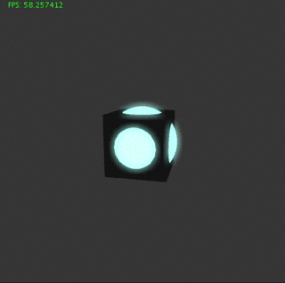
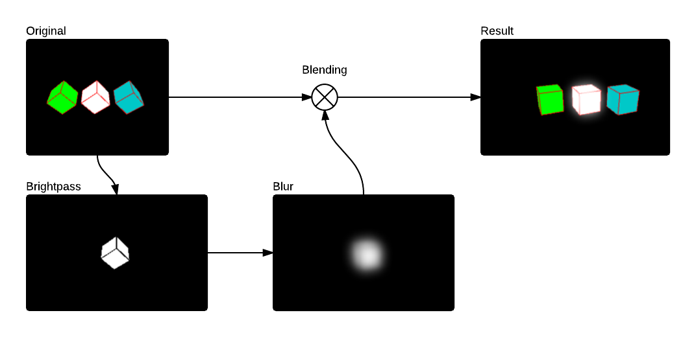
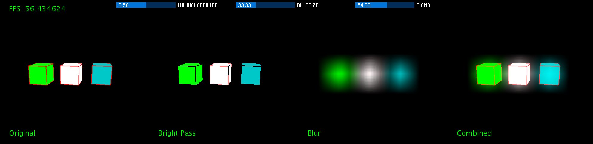

# Processing Bloom Filter
An example of a bloom filter as post FX in [processing3](https://processing.org/).

Post-processing filters are great tools to give a rendered (and realistic) scene more utterance. For example the bloom filter helps to simulate the light diffusion to be more **realistic**.

There are a lot of tutorials which help you to implement a bloom filter in OpenGL (e.g. [Learn OpenGL - Bloom](https://learnopengl.com/#!Advanced-Lighting/Bloom)). But for **processing** I could not find one that is as performant as I needed it in my `P3D` renderings. There are some which are implemented directly on the **CPU** and rely on `loadPixel` to copy the buffer onto the CPU and back to the GPU.

So I tried to find a way between implementing it directly in OpenGL ([with processing](https://github.com/processing/processing/wiki/Advanced-OpenGL)) and the CPU approach. Because the direct implementation in OpenGL could break the processing version independence of my sketches.

Keep in mind that this is **not the fastest** impelmentation, but one that is working with `P3D` and I still try to improve it.



## Post FX Library
For a better usage I have implemented a post fx library which currently contains following effects:

* bright pass
* blur horizontal
* blur vertical

You can use it on every `PGraphics3D` (except `g`) object like this:

```java
PostFX fx = new PostFX(width, height);

// bloom filter
PGraphics bloom = fx.filter(canvas)
    .brightPass(0.5)
    .blur(20, 50, false)
    .blur(20, 50, true)
    .close();
    
// draw the bloom onto the original image
blendMode(BLEND);
image(canvas, 0, 0);

blendMode(SCREEN);
image(bloom, 0, 0);
```

## Implementation

### Basic Idea
To implement a bloom you should first understand how the effect is created:



1. Draw you `original` image
2. Create a `bright pass` image of the `original`
3. Blur the `bright pass` image (horizontal & vertical)
4. Screen-blend it over the `original` image

Sound's easy, right?

### Processing
Now how to implement that in processing?

In the idea chapter I was talking about `images` but in `P3D` there is no performant `PImage` implementation. So the idea is to use `PTexture` for the images and render them onto the main context after the process.

To make it as performant as possible you should use [GLSL Shaders](https://processing.org/tutorials/pshader/). For the bloom filter you need one GLSL Shader for the **brightpass** and one for the **blur filter**. We take a look at them later in the shader chapter.

To store the results of our shaders I used `PGraphics` objects. The `canvas` is the original image and the `brightPass` stores the bright pass result.

```java
PGraphics canvas = createGraphics(surfaceWidth, surfaceHeight, P3D);

PGraphics brightPass = createGraphics(surfaceWidth, surfaceHeight, P2D);
PGraphics horizontalBlurPass = createGraphics(surfaceWidth, surfaceHeight, P2D);
PGraphics verticalBlurPass = createGraphics(surfaceWidth, surfaceHeight, P2D); 
```

In every draw call you have first to render your content onto the `canvas`, then copy it onto the `brightpass` graphics and let the shader do the filter work.


```java
// render content onto canvas
canvas.beginDraw();
render(canvas);
canvas.endDraw();

// copy canvas onto bright pass
brightPass.beginDraw();
brightPass.background(0, 0);
brightPass.image(canvas, 0, 0);

brightPass.endDraw();
```
After the copy process you can **blur** the image with the filter shader. First horizontal and then vertical. 

```java
// blur horizontal pass
horizontalBlurPass.beginDraw();
blurFilter.set("horizontalPass", 1);
horizontalBlurPass.shader(blurFilter);
horizontalBlurPass.image(brightPass, 0, 0);
horizontalBlurPass.endDraw();

// blur vertical pass
verticalBlurPass.beginDraw();
blurFilter.set("horizontalPass", 0);
verticalBlurPass.shader(blurFilter);
verticalBlurPass.image(horizontalBlurPass, 0, 0);
verticalBlurPass.endDraw();
```

Now you just have to draw the original `canvas` first and then the `verticalBlurPass` texture graphics onto it. You have to change the `blendMode` to `SCREEN`. Otherwise the image will be black except for your blurred bright spots.

```java
blendMode(BLEND);
image(canvas, 0, 0);

blendMode(SCREEN);
image(verticalBlurPass, 0, 0);
```

In my example sketch you see the process visualised in four steps:



#### Shader
To make the filtering faster you have to use GLSL Shaders. Because you are working with `PTexture` it is important to use **texture shaders** and not normal color shaders.

The **vertex shader** is just a basic texture shader which passes the color and position to the renderer.

```glsl
#define PROCESSING_TEXTURE_SHADER

uniform mat4 transform;
uniform mat4 texMatrix;

attribute vec4 vertex;
attribute vec4 color;
attribute vec2 texCoord;

varying vec4 vertColor;
varying vec4 vertTexCoord;

void main() {
  gl_Position = transform * vertex;
    
  vertColor = color;
  vertTexCoord = texMatrix * vec4(texCoord, 1.0, 1.0);
}
```

*Bloom Vertex Shader*

The fragment shader is for the brightpass filter. It filters every color out which has a luminence less then the `brightPassThreshold`. The `luminanceVector` contains the values to get the [relative luminance](https://en.wikipedia.org/wiki/Relative_luminance) of a rgb color value.

```glsl
uniform sampler2D texture;

varying vec4 vertColor;
varying vec4 vertTexCoord;

uniform float brightPassThreshold;

void main() {
	vec3 luminanceVector = vec3(0.2125, 0.7154, 0.0721);
    vec4 c = texture2D(texture, vertTexCoord.st) * vertColor;

    float luminance = dot(luminanceVector, c.xyz);
    luminance = max(0.0, luminance - brightPassThreshold);
    c.xyz *= sign(luminance);
    c.a = 1.0;

    gl_FragColor = c;
}
```

*Bloom Fragment Shader*

The blur shader is very configurable. You can change the sigma and the blur size.

```glsl
uniform sampler2D texture;
 
// The inverse of the texture dimensions along X and Y
uniform vec2 texOffset;
 
varying vec4 vertColor;
varying vec4 vertTexCoord;
 
uniform int blurSize;       
uniform int horizontalPass; // 0 or 1 to indicate vertical or horizontal pass
uniform float sigma;        // The sigma value for the gaussian function: higher value means more blur
                            // A good value for 9x9 is around 3 to 5
                            // A good value for 7x7 is around 2.5 to 4
                            // A good value for 5x5 is around 2 to 3.5
                            // ... play around with this based on what you need <span class="Emoticon Emoticon1"><span>:)</span></span>
 
const float pi = 3.14159265;
 
void main() {  
  float numBlurPixelsPerSide = float(blurSize / 2); 
 
  vec2 blurMultiplyVec = 0 < horizontalPass ? vec2(1.0, 0.0) : vec2(0.0, 1.0);
 
  // Incremental Gaussian Coefficent Calculation (See GPU Gems 3 pp. 877 - 889)
  vec3 incrementalGaussian;
  incrementalGaussian.x = 1.0 / (sqrt(2.0 * pi) * sigma);
  incrementalGaussian.y = exp(-0.5 / (sigma * sigma));
  incrementalGaussian.z = incrementalGaussian.y * incrementalGaussian.y;
 
  vec4 avgValue = vec4(0.0, 0.0, 0.0, 0.0);
  float coefficientSum = 0.0;
 
  // Take the central sample first...
  avgValue += texture2D(texture, vertTexCoord.st) * incrementalGaussian.x;
  coefficientSum += incrementalGaussian.x;
  incrementalGaussian.xy *= incrementalGaussian.yz;
 
  // Go through the remaining 8 vertical samples (4 on each side of the center)
  for (float i = 1.0; i <= numBlurPixelsPerSide; i++) { 
    avgValue += texture2D(texture, vertTexCoord.st - i * texOffset * 
                          blurMultiplyVec) * incrementalGaussian.x;         
    avgValue += texture2D(texture, vertTexCoord.st + i * texOffset * 
                          blurMultiplyVec) * incrementalGaussian.x;         
    coefficientSum += 2.0 * incrementalGaussian.x;
    incrementalGaussian.xy *= incrementalGaussian.yz;
  }
 
  gl_FragColor = avgValue / coefficientSum;
}
```

*Blur Vertex Filter ([by clankill3r](https://forum.processing.org/two/discussion/comment/24078/#Comment_24078))*

## About
Developed by Florian Bruggisser in 2016
with 

* [processing](https://processing.org/)
* [controlP5](http://www.sojamo.de/libraries/controlP5/)
